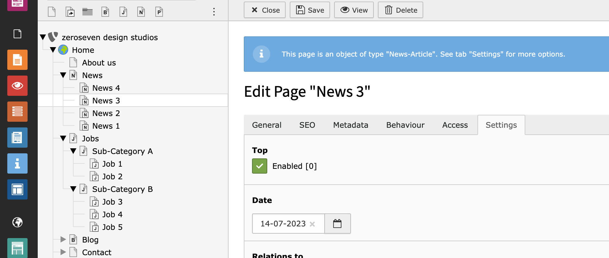

# Pagebased

Manage objects like news, events, blog posts, jobs, etc. in the TYPO3 backend as a "normal" TYPO3 page easily. This
extension provides you with the necessary plugins and filters, categories, tags, and other useful functions.

## Pages vs. records

Instead of displaying records in a complicated way like a page, this extension uses the full TYPO3 bandwidth to display
content using existing content elements. Besides the additional functions of the pagebased extension, all known TYPO3
features like metadata, translation handling, caching, sitemaps, and URLs are available without any configuration.



## Get there fast with little code
From news to [blog posts](https://github.com/zeroseven/pagebased_blog), a job offer, or an event, page objects usually have a lot in
common. [Using a configuration](#object-registration), you can activate or deactivate individual functions for each page object as needed:

* list plugin
* filter plugin
* tags
* categories
* contacts
* relations

Furthermore, the entire logic and functionality for the individual page objects lie within the pagebased extension
itself. This way, the controller, repository, pagination, etc. are centrally controlled and can be updated easily.
Additionally, new objects can be created in just a few seconds - [give it a try!](#create-your-own-extension)

## Create your own extension

The fast and easy way to create a new Pagebased-Extension is to build it from the extension dummy template.

1. Install [cookiecutter](https://cookiecutter.readthedocs.io/en/stable/installation.html#alternate-installations)
2. Run `cookiecutter pagebased/Resources/Private/ExtensionDummy`

You will be asked for a view variables like extension key, object name, etc. After that a new configured extension will
be generated for you.


## Configuration

### Object registration

Create a new registration in your `ext_localconf.php`:

```php
call_user_func(static function () {
    $object = \Zeroseven\Pagebased\Registration\ObjectRegistration::create('Job')
        ->setClassName(\Vendor\NewExtension\Domain\Model\Job::class)
        ->setControllerClass(\Vendor\NewExtension\Controller\JobController::class)
        ->setRepositoryClass(\Vendor\NewExtension\Domain\Repository\JobRepository::class)
        ->enableTop()        // Enable top job feature for job objects
        ->enableTags()       // Enable tag feature for job objects, so tagging and filtering tags is possible
        ->enableTopics(24)   // Enable topics for jobs and give it a pid where to store these
        ->enableContact(24); // Enable responsible contact person for job objects

    $category = \Zeroseven\Pagebased\Registration\CategoryRegistration::create('Job-Category')
        ->setClassName(\Vendor\NewExtension\Domain\Model\Category::class)
        ->setRepositoryClass(\Vendor\NewExtension\Domain\Repository\CategoryRepository::class)
        ->setDocumentType(44);

    $listPlugin = \Zeroseven\Pagebased\Registration\ListPluginRegistration::create('Job list')
        ->setDescription('Display jobs in a super nice list');

    $filterPlugin = \Zeroseven\Pagebased\Registration\FilterPluginRegistration::create('Job filter')
        ->setDescription('Filter jobs');

    \Zeroseven\Pagebased\Registration\Registration::create('extension_name')
        ->setObject($object)
        ->setCategory($category)
        ->enableListPlugin($listPlugin)
        ->enableFilterPlugin($filterPlugin)
        ->store();
});
```

### Override existing registration

In case you want to override an existing registration, the event [`BeforeRegistrationEvent`](Classes/Registration/Event/BeforeStoreRegistrationEvent.php) gives you access to all
properties to update them before the pagebased extension does the rest.

Alternatively an extension configuration template will be created automatically. Use the settings module of the TYPO3
InstallTool to override the default values.

### Extend plugin flexForm

Use the [`AddFlexFormEvent`](Classes/Registration/Event/AddFlexFormEvent.php) to extend the flexForm of a plugin. Example:

```php
<?php

declare(strict_types=1);

namespace Zeroseven\Jobs\EventListener;

use Zeroseven\Pagebased\Registration\Event\AddFlexFormEvent;

class ExtendFlexFormEvent
{
    public function __invoke(AddFlexFormEvent $event)
    {
        $flexFormConfiguration = $event->getFlexFormConfiguration();

        if ($flexFormConfiguration->getType() === 'jobs_list' && $sheet = $flexFormConfiguration->getSheet('filter')) {
            $sheet->addField('settings.customField', [
                'type' => 'input',
                'eval' => 'trim,required'
            ], 'Custom field');
        }
    }
}
```

### Extend your template

#### TypoScript

##### User object

```typo3_typoscript
page.1684843032 = USER
page.1684843032 {
    userFunc = Zeroseven\Pagebased\Utility\RenderUtility->renderUserFunc
    file = EXT:my_extension/Resources/Private/Templates/Info.html
    registration = my_registration_identifier, another_registration_identifier
}
```

##### Data processor:

```typo3_typoscript
# Example to show the next object
page.1686075417 = HMENU
page.1686075417 {
    special = browse
    special.items = next

    1 = TMENU
    1.NO {
        doNotLinkIt = 1
        stdWrap.cObject = FLUIDTEMPLATE
        stdWrap.cObject {
            file = EXT:zeroseven_projects/Resources/Private/Templates/Info/Next.html

            dataProcessing.10 = Zeroseven\Pagebased\DataProcessing\ObjectProcessor
            dataProcessing.10 {
                uid.data = field:uid
                registration = my_registration_identifier
            }
        }
    }
}
```

#### Custom content element

Create a custom content element to display the object information:

```typo3_typoscript
tt_content.my_content_element =< lib.contentElement
tt_content.my_content_element {
    templateName = MyContentElement
    templateRootPaths.1687792159 = EXT:my_extension/Resources/Private/Templates/Content/

    dataProcessing.1687792159 = Zeroseven\Pagebased\DataProcessing\ObjectProcessor
    dataProcessing.1687792159.registration = my_registration_identifier
}
```

#### Conditions

##### TypoScript

```typo3_typoscript
page.10 = TEXT
page.10.value = It's a normal page.

[my_registration_identifier.object]
    page.10.value = Nice! It's an object.
[my_registration_identifier.category]
    page.10.value = This is a category page.
[global]
```

##### Fluid

```html

<html xmlns:pagebased="http://typo3.org/ns/Zeroseven/Pagebased/ViewHelpers" data-namespace-typo3-fluid="true">
<pagebased:condition.isObject registration="my_registration_identifier">
    <p>Nice! It's an object.</p>
</pagebased:condition.isObject>
<pagebased:condition.isCategory registration="my_registration_identifier">
    <p>This is a category page.</p>
</pagebased:condition.isCategory>
</html>
```

## Commands and Tasks

Update registration information of category and object pages with the command `pagebased:detection`. Example:

| Command | Description |
|---------|-------------|
|`pagebased:detection 7`| Starting from page uid: `7`. |
|`pagebased:detection 7 2`| Starting from page uid: `7` with depth of `2` levels |

This can be useful if you change the identifier of a registration, or you add pages by API.

## FAQ

### Can objects be extended?

Yes. As usual in TYPO3, the whole structure is based on the MVC concept with extbase. Single classes can therefore be overridden and extended. New properties in page objects are automatically recognized and can be used directly for filtering.

### Is this an extension builder?

No. The functionality and logic are centered in the pagebased extension. This way, you don't have any redundant code in the project and you can easily update it.

### Can multiple page objects run simultaneously in a project?

Yes, any number of objects, such as jobs, news, etc. can run simultaneously in your project. They can be configured differently and still use the same code.

### Are page objects SEO-optimized?

All SEO functions that TYPO3 provides can be used on the detail pages without restriction. In addition, structured data can be added via an PSR14 event.

### Can the same contacts and topics be used centrally?

Yes, you can flexibly define one or more storage folders for each page object. This means that contact persons and topics can be used together or individually for page objects.
The editor receives a note in the backend for which objects there are, e.g. a contact available.

### Do I mandatorily need an object category?

Yes! The subpages of an object category are automatically identified as objects. Therefore, it is necessary to create a category first. The category behaves, similarly to objects, like a "normal" TYPO3 page.
